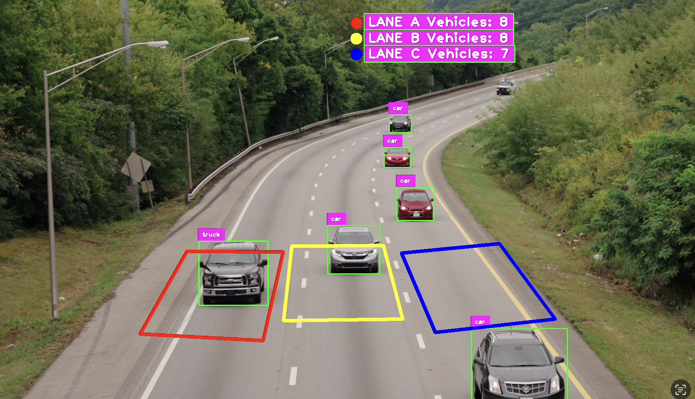

# Vehicle Counting in Lanes

Real-time multi-lane vehicle **detection**, **classification**, **tracking**, and **counting** using **YOLOv11**, **SORT**, and **OpenCV**.

## Features
- Detects and classifies vehicles: **car**, **truck**, **bus** (extendable via `classes.txt`)
- Tracks each vehicle with persistent IDs via **SORT** (Kalman Filter + IoU matching)
- Counts vehicles **per lane** using polygon zones and line-crossing logic
- On-frame overlay with boxes, labels, IDs, and per-lane counters (OpenCV + cvzone)
- Works on recorded videos (e.g., `assets/video.mp4`)


## Demo

[](https://github.com/dariomonopoli-dev/yolo-vehicle-counting/blob/main/assets/demo.mp4)
Click for demo.


## Installation

### 1. Create a virtual environment (recommended)
```bash
python3 -m venv .venv
source .venv/bin/activate
python -m pip install --upgrade pip setuptools wheel
```
### 2. Install dependencies
```
pip install ultralytics opencv-python cvzone numpy filterpy
```
### 3. Model weights
Place yolo11n.pt in the project root (or adjust the path in main.py).
Download from Ultralytics if you don’t have it.

## Usage
```
python main.py
```
Change video_path in main.py to point to your video (default: assets/video.mp4).

Adjust lane polygons (road_zoneA/B/C) and corresponding lines if your scene differs.

## References

- **YOLO (Ultralytics)**
  - Repository: https://github.com/ultralytics/ultralytics
  - Paper (YOLOv5/YOLO family overview): Glenn Jocher et al., *YOLO by Ultralytics*, 2023–. https://docs.ultralytics.com
  - License: AGPL-3.0 (Ultralytics code), model weights under Ultralytics terms

- **SORT: Simple Online and Realtime Tracking**
  - Repository: https://github.com/abewley/sort
  - Paper: Alex Bewley, Zongyuan Ge, Lionel Ott, Fabio Ramos, Ben Upcroft.  
    *Simple Online and Realtime Tracking*. ICIP 2016. https://arxiv.org/abs/1602.00763
  - License: GPL-3.0 (this applies to `sort.py`)
